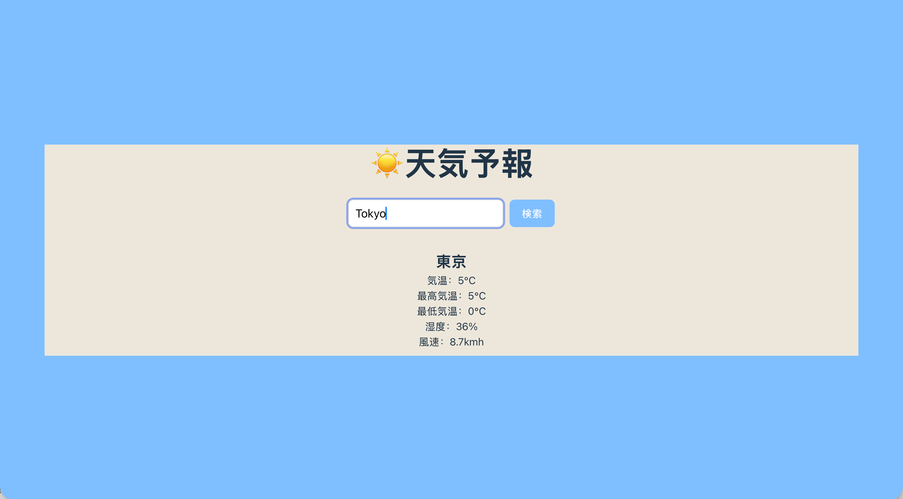

# React Weather App (Real-time Forecast)

## 📝 项目简介
一个基于 React 开发的轻量级、响应式实时天气预报应用。用户可以通过搜索全球城市，实时获取当前的温度、湿度、风速以及当天的最高/最低气温。

## ✨ 功能特性
- ✅ **全球城市搜索**：集成 Open-Meteo Geocoding API，实现从“城市名”到“经纬度”的精准转换。
- ✅ **实时多维数据**：除了基础温度，还展示了体感湿度、风速以及当日温差范围。
- ✅ **健壮状态管理**：内置 Loading 加载动画及友好的错误处理机制（如“城市未找到”）。
- ✅ **本地化体验**：界面采用中日文结合设计，适配东亚用户视觉习惯。

## 🛠️ 技术栈
- **框架**: React (Hooks: `useState`, `useEffect`)
- **API**: [Open-Meteo API](https://open-meteo.com/) (无须密钥，隐私友好)
- **样式**: CSS3 (Responsive Design)

## 🌐 关于 API 获取步骤（详细说明）
本项目采用 **Open-Meteo API**。与其他天气 API 不同，它最大的优势是**无需申请 API Key** 即可直接调用，非常适合快速开发与部署。

### 数据获取流程：
1. **第一步：地理编码 (Geocoding API)**
   - **接口**: `https://geocoding-api.open-meteo.com/v1/search?name={cityName}`
   - **作用**: 用户输入城市名后，通过此接口获取该城市的地理信息（经度、纬度、国家等）。
2. **第二步：天气预测 (Forecast API)**
   - **接口**: `https://api.open-meteo.com/v1/forecast?latitude={lat}&longitude={lon}`
   - **作用**: 根据第一步获得的经纬度，请求具体的实时气象数据及每日预报。

## 📸 项目截图



## 🚀 本地运行
```bash
# 安装依赖
npm install

# 启动开发服务器
npm run dev

#启动后访问：
http://localhost:5173